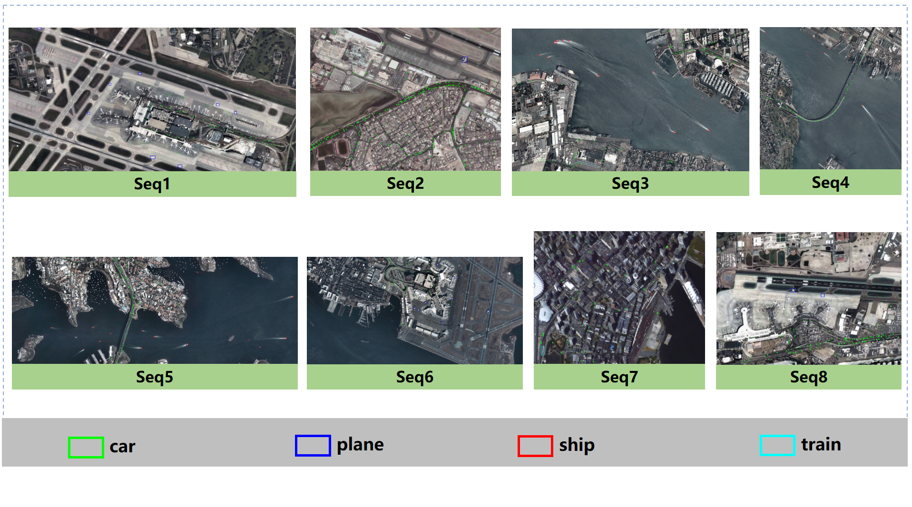

# LMOD:A Large-scale and Multiclass Object Detection Dataset for Satellite Videos
This is the official website of the **LMOD** dataset.
## Getting the dataset
:star: The dataset application is very simple and requires only the following two steps:  
- [x] Please fill in this [application form](/Application%20form).
- [x] Please send your completed application form to this E-mail address:`rs_devotee@163.com`.  
When we receive your application, we will reply as soon as possible, thank you for your support!
## Introduction
* The LMOD dataset is the first satellite video multi-object detection dataset with both **large-scale and multiclass labeling features**. LMOD consists of eight sequences from seven videos.  
- LOMD has a wide range of annotation, the smallest image width is **1500×1160**, and the largest image width is **4000×2000**. The large range of scenes can better simulate the effect of object detection methods used in real scenes, but at the same time, it brings more challenges for object detection.  
  
* The LMOD is labeled with **459,713 vehicle objects**, **9,390 aircraft objects**, **10,536 ship objects** and **693 train objects**, for a total of **480,332 objects**, with each sequence labeled with **at least two classes of objects**.
  
## Visualization
  
## Data Source
- Satellite videos used in LMOD are collected from [JiLin-1](https://www.jl1mall.com/) satellite constellation.
## Contact
:mailbox: If you have any questions, please contact `rs_devotee@163.com`.
